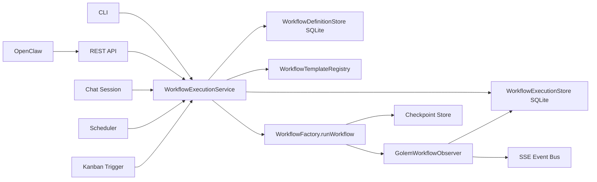
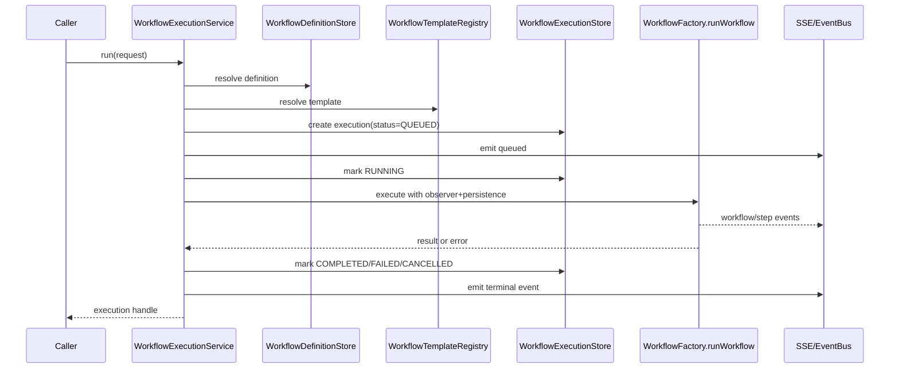
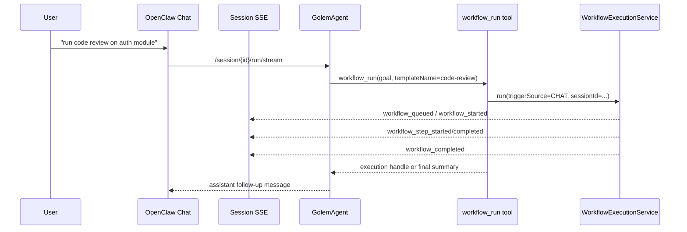
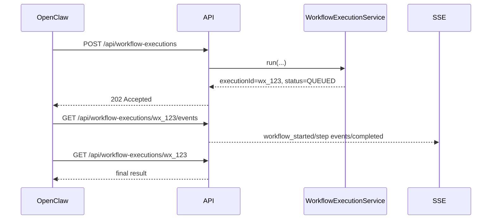
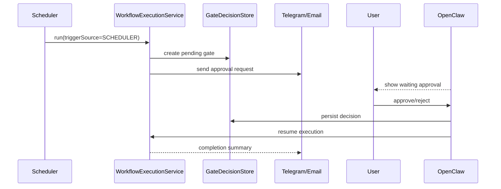

# Design del Sistema Workflow Production-Ready per Golem

## Obiettivi

Questo documento propone l'evoluzione del sistema workflow di Golem da:

- catalogo CRUD in-memory non collegato al runtime;
- esecuzione TramAI richiamata in modo ad-hoc da CLI e API;
- assenza di storico, osservabilità, multi-tenancy e trigger esterni;

a un sistema production-ready con:

- definizioni persistite in SQLite;
- registry dinamico di template eseguibili;
- pipeline di esecuzione unica per CLI, API, chat, scheduler e kanban;
- streaming SSE e storico esecuzioni;
- cancellazione, limiti concorrenti e resume/checkpoint.

Il design rispetta i vincoli correnti:

- nessuna nuova dipendenza oltre a Kotlin stdlib, `kotlinx-serialization`, Exposed/SQLite e TramAI;
- compatibilità con modalità CLI e API;
- OpenClaw come consumer di prima classe;
- riuso dell'infrastruttura SSE esistente;
- backward compatibility con l'attuale CRUD `/api/workflows`.

---

## Stato attuale sintetico

| Area | Stato attuale | Limite |
|------|---------------|--------|
| Workflow definitions | `ConcurrentHashMap` in `WorkflowRoutes.kt` | Perdita dati al riavvio |
| Esecuzione workflow | TramAI DSL (`TeamWorkflowSteps`, `JvmWorkflowTemplates`) | Non collegata alle definitions CRUD |
| CLI | Chiama `wf.run(...)` diretto | Nessun observer/persistence uniforme |
| API | `POST /api/workflows/run` solo `code-review` | Bypassa `WorkflowFactory.runWorkflow()` |
| Chat | Solo agent loop e SSE sessione | Nessun workflow come cittadino di prima classe |
| Scheduler | Esegue goal agente generico | Nessun trigger workflow |
| Kanban | Solo persistence task | Nessun trigger workflow |
| Resume | Supportato da TramAI factory lato file checkpoint | Non integrato nel lifecycle API/app |

Conclusione: i pezzi riusabili ci sono gia`, ma manca un orchestration layer applicativo che colleghi definizione, runtime, persistenza, osservabilita` e trigger.

---

## Architettura target



Principio guida: ogni esecuzione workflow passa da un solo servizio applicativo, indipendentemente dal trigger.

---

## 1. Evoluzione della definizione dei workflow

### Modello dati

Le `WorkflowDefinition` smettono di essere metadata in-memory e diventano record SQLite.

```kotlin
@Serializable
data class WorkflowDefinitionRecord(
    val id: String,
    val name: String,
    val description: String,
    val enabled: Boolean,
    val templateName: String,
    val parametersJson: String,
    val createdAt: Long,
    val updatedAt: Long,
)
```

### Schema SQLite

| Colonna | Tipo | Note |
|---------|------|------|
| `id` | `varchar(64)` | PK, stable id |
| `name` | `varchar(255)` | Nome utente |
| `description` | `text` | Descrizione |
| `enabled` | `bool` | Flag attivazione |
| `template_name` | `varchar(128)` | Chiave del template runtime |
| `parameters_json` | `text` | JSON blob validato |
| `created_at` | `long` | epoch millis |
| `updated_at` | `long` | epoch millis |

### Exposed store proposto

```kotlin
interface WorkflowDefinitionStore : AutoCloseable {
    suspend fun list(userId: String? = null): List<WorkflowDefinitionRecord>
    suspend fun get(id: String): WorkflowDefinitionRecord?
    suspend fun create(input: CreateWorkflowDefinition): WorkflowDefinitionRecord
    suspend fun update(id: String, patch: UpdateWorkflowDefinition): WorkflowDefinitionRecord?
    suspend fun delete(id: String): Boolean
    suspend fun setEnabled(id: String, enabled: Boolean): WorkflowDefinitionRecord?
}
```

### Collegamento tra definition e `Workflow` TramAI

La `WorkflowDefinition` non serializza il DAG. Serializza invece:

- il riferimento a un `templateName`;
- il blob `parametersJson`;
- metadata funzionali per UI e trigger.

La costruzione del workflow reale avviene a runtime tramite registry:

```kotlin
interface WorkflowTemplate {
    val name: String
    val version: String
    fun build(definition: WorkflowDefinitionRecord): Workflow<GolemState, WorkflowExecutionResult>
}
```

### Registry dinamico dei template

```kotlin
class WorkflowTemplateRegistry(
    private val templates: MutableMap<String, WorkflowTemplate> = linkedMapOf(),
) {
    fun register(template: WorkflowTemplate) {
        templates[template.name] = template
    }

    fun resolve(name: String): WorkflowTemplate =
        templates[name] ?: error("Unknown workflow template: $name")

    fun list(): List<WorkflowTemplate> = templates.values.toList()
}
```

I template built-in iniziali:

- `code-review`
- `jvm-debug`
- `jvm-refactor`
- `jvm-migration`
- `team-run`

### Strategia di registrazione

All'avvio di Golem:

1. `WorkflowTemplateRegistry` registra template built-in.
2. `WorkflowDefinitionBootstrapper` esegue seed idempotente solo se il record non esiste.
3. API e CLI interrogano il registry per validare `templateName`.

### Parametri

`parametersJson` permette configurazione senza schema rigido nel DB. Validazione demandata al template:

```kotlin
@Serializable
data class CodeReviewWorkflowParameters(
    val reviewers: List<String> = listOf("security-reviewer", "style-reviewer", "test-reviewer"),
    val summarizerPersona: String? = null,
    val includeDiff: Boolean = true,
)
```

Ogni template espone:

- decoder del JSON;
- validazione semantica;
- defaulting;
- eventuale mappatura in `GolemState`.

### Backward compatibility CRUD

Le API esistenti restano valide:

- `GET /api/workflows`
- `POST /api/workflows`
- `PUT /api/workflows/{id}`
- `DELETE /api/workflows/{id}`
- `POST /api/workflows/{id}/toggle`

Ma il body viene esteso in modo compatibile:

```kotlin
@Serializable
data class CreateWorkflowRequest(
    val name: String,
    val description: String,
    val templateName: String? = null,
    val parametersJson: String? = null,
)
```

Regola di compatibilita`:

- se `templateName == null`, default a `"code-review"` per preservare il comportamento atteso dalla UI attuale;
- `parametersJson` default a `"{}"`.

---

## 2. Pipeline di esecuzione unificata

### Nuovo servizio applicativo

```kotlin
interface WorkflowExecutionService {
    suspend fun run(request: WorkflowExecutionRequest): WorkflowExecutionHandle
    suspend fun cancel(executionId: String, requestedBy: String?): Boolean
    suspend fun get(executionId: String): WorkflowExecutionRecord?
    suspend fun list(query: WorkflowExecutionQuery): List<WorkflowExecutionRecord>
}
```

### Modello richiesta

```kotlin
@Serializable
data class WorkflowExecutionRequest(
    val definitionId: String? = null,
    val templateName: String? = null,
    val goal: String,
    val userId: String? = null,
    val sessionId: String? = null,
    val triggerSource: TriggerSource,
    val triggerRef: String? = null,
    val inputJson: String = "{}",
    val streamChannelId: String? = null,
)

@Serializable
enum class TriggerSource {
    CLI,
    API,
    CHAT,
    SCHEDULER,
    KANBAN,
    OPENCLAW,
}
```

### Pipeline standard



### Unificazione CLI e API

#### CLI

L'attuale `WorkflowCommands.kt` deve smettere di chiamare `wf.run(...)` diretto. La CLI deve:

1. risolvere `definitionId` o `templateName`;
2. costruire `WorkflowExecutionRequest(triggerSource = CLI)`;
3. chiamare `WorkflowExecutionService.run(...)`;
4. opzionalmente attendere il completamento in foreground;
5. stampare risultato finale o stream locale status.

#### API

`POST /api/workflows/run` resta disponibile ma diventa un adapter:

1. traduce `WorkflowRunRequest`;
2. chiama `WorkflowExecutionService.run(...)`;
3. se `wait=true`, attende il terminal state;
4. se asincrono, ritorna `202 Accepted` con `executionId`.

### Esecuzione da chat session

Per la chat servono due livelli:

1. detection intenzionale dentro l'agente o lato API;
2. step di esecuzione workflow che eredita il contesto di sessione.

Proposta minima robusta:

- introdurre tool `workflow_run` nel registry strumenti dell'agente;
- il tool chiama `WorkflowExecutionService`;
- il tool passa `sessionId`, `userId`, ultimo transcript o `goal` sintetizzato;
- il risultato finale viene reiniettato come messaggio tool result e, se streaming, come eventi SSE.

Snippet:

```kotlin
data class WorkflowRunToolArgs(
    val definitionId: String? = null,
    val templateName: String? = null,
    val goal: String,
)
```

Questo e` piu` solido di parsing fragile del testo utente lato API.

### Esecuzione da Scheduler

Lo scheduler oggi esegue un goal agente generico. Va esteso con un job workflow-specifico.

```kotlin
data class ScheduledJob(
    val id: String,
    val name: String,
    val goal: String,
    val cronExpression: String,
    val enabled: Boolean,
    val workflowDefinitionId: String? = null,
    val workflowInputJson: String? = null,
    ...
)
```

Comportamento:

- se `workflowDefinitionId != null`, il job lancia un workflow;
- altrimenti conserva il path legacy agente generico.

### Esecuzione da Kanban

Aggiungere una tabella trigger:

| Colonna | Tipo | Note |
|---------|------|------|
| `id` | `varchar(64)` | PK |
| `workflow_definition_id` | `varchar(64)` | FK |
| `from_status` | `varchar(32)` nullable | opzionale |
| `to_status` | `varchar(32)` | stato target |
| `label_filter` | `varchar(128)` nullable | opzionale |
| `enabled` | `bool` | flag |

Su `SqliteKanbanStore.update(...)`, dopo il commit:

1. confrontare `old.status` vs `new.status`;
2. risolvere trigger matching;
3. creare `WorkflowExecutionRequest(triggerSource = KANBAN, triggerRef = task.id)`;
4. includere in `inputJson` i dettagli task.

### Esecuzione da OpenClaw

OpenClaw non deve conoscere TramAI. Deve lavorare solo via API:

1. `GET /api/workflow-definitions`
2. `POST /api/workflow-executions`
3. `GET /api/workflow-executions/{id}`
4. `GET /api/workflow-executions?sessionId=...`
5. `GET /api/workflow-executions/{id}/events` SSE
6. `POST /api/workflow-executions/{id}/cancel`

---

## 3. Integrazione chat-workflow

### Invocazione dal chat session

Scenario: utente scrive "run code review on the auth module".

Approccio consigliato:

1. il `GolemAgent` riceve tra i tool anche `workflow_run`;
2. il modello decide di invocarlo;
3. il tool crea un'esecuzione workflow con `triggerSource = CHAT`;
4. il workflow usa:
   - `sessionId` corrente;
   - transcript recente;
   - goal esplicito dell'utente;
5. la chat riceve streaming intermedio e risultato finale.

### Estensione di `GolemState`

```kotlin
data class GolemState(
    val goal: String,
    val config: GolemConfig = GolemConfig(),
    val agentDef: AgentDefinition? = null,
    val conversation: List<ChatMessage> = emptyList(),
    val turnCount: Int = 0,
    val intermediateResults: Map<String, String> = emptyMap(),
    val result: String? = null,
    val executionId: String? = null,
    val sessionId: String? = null,
    val userId: String? = null,
    val triggerSource: String? = null,
    val cancellationRequested: Boolean = false,
)
```

`conversation` deve diventare utile davvero:

- input a step che richiedono contesto chat;
- resume/checkpoint leggibili;
- audit trail.

### Come il risultato rientra in chat

Due possibilita`:

1. tool result sincrono: il tool aspetta il completamento e restituisce testo finale;
2. tool result asincrono: il tool restituisce subito `executionId`, mentre SSE aggiorna la UI fino al completamento.

Per OpenClaw la seconda opzione e` migliore. Per CLI si puo` usare modalita` bloccante.

### Eventi SSE intermedi

Riutilizzare `GolemWorkflowObserver`, ma standardizzando payload tipizzati:

```kotlin
@Serializable
data class WorkflowStatusEvent(
    val executionId: String,
    val workflowId: String,
    val status: String,
    val stepName: String? = null,
    val message: String? = null,
    val timestamp: Long,
)
```

Tipi evento consigliati:

- `workflow_queued`
- `workflow_started`
- `workflow_step_started`
- `workflow_step_completed`
- `workflow_step_failed`
- `workflow_output`
- `workflow_completed`
- `workflow_failed`
- `workflow_cancelled`

### Presenza nel chat history

Per audit e UX, la sessione deve mostrare i workflow come messaggi sintetici persistiti.

Proposta:

```kotlin
@Serializable
data class WorkflowChatMessage(
    val role: String = "system",
    val content: String,
    val executionId: String,
    val workflowDefinitionId: String?,
    val status: String,
)
```

Pattern:

- all'avvio: messaggio "Workflow avviato: code-review";
- sugli step non serve salvare ogni evento come messaggio, basta SSE live;
- al completamento: messaggio finale con summary e link a detail execution.

### Sequenza chat -> workflow



---

## 4. Multi-tenancy e concorrenza

### Isolamento per utente

Anche se oggi Golem e` spesso single-user, il modello dati deve supportare isolamento nativo.

Campi richiesti su esecuzione:

- `userId`
- `sessionId`
- `triggerSource`
- `triggerRef`

Su definitions ci sono due opzioni:

1. global definitions + ACL futura;
2. owner-aware definitions.

Per evitare migrazione doppia, consiglio subito:

| Colonna | Tipo | Note |
|---------|------|------|
| `owner_user_id` | `varchar(128)` nullable | `null` = shared/global |

### Esecuzioni concorrenti

Il runtime deve supportare esecuzioni parallele, ma con limiti configurabili:

```kotlin
data class WorkflowExecutionLimits(
    val globalMaxConcurrent: Int = 4,
    val perUserMaxConcurrent: Int = 2,
    val queueCapacity: Int = 100,
)
```

### Queue manager

Senza nuove dipendenze, basta un coordinator coroutine-based:

```kotlin
interface WorkflowDispatcher {
    suspend fun submit(record: WorkflowExecutionRecord, block: suspend () -> Unit)
}
```

Implementazione:

- coda FIFO in memoria per il processo corrente;
- stato persistito in SQLite come `QUEUED`;
- recovery all'avvio per record `RUNNING`/`QUEUED` orfani.

Nota: in modalita` CLI one-shot non serve queue complessa; in modalita` server/daemon si`.

### Stati esecuzione

| Stato | Significato |
|-------|-------------|
| `QUEUED` | Accettata ma non partita |
| `RUNNING` | In corso |
| `WAITING_APPROVAL` | Pausa su gate umano |
| `COMPLETED` | Terminata con successo |
| `FAILED` | Fallita |
| `CANCEL_REQUESTED` | L'utente ha chiesto stop |
| `CANCELLED` | Terminata per cancellazione |

### Cancellazione graceful

Serve un `ExecutionCancellationRegistry` in memoria:

```kotlin
interface WorkflowCancellationRegistry {
    fun register(executionId: String, job: kotlinx.coroutines.Job)
    fun requestCancel(executionId: String): Boolean
    fun unregister(executionId: String)
}
```

Meccanica:

1. `POST /api/workflow-executions/{id}/cancel`
2. store aggiorna stato `CANCEL_REQUESTED`
3. registry cancella il `Job`
4. observer emette `workflow_cancelled`
5. store finale salva `CANCELLED`

Per step cooperativi, `GolemState.cancellationRequested` puo` essere letto nei merge o gate.

---

## 5. Osservabilita` e persistenza

### Store esecuzioni SQLite

```kotlin
@Serializable
data class WorkflowExecutionRecord(
    val id: String,
    val definitionId: String?,
    val workflowName: String,
    val status: String,
    val startedAt: Long?,
    val completedAt: Long?,
    val result: String?,
    val error: String?,
    val userId: String?,
    val sessionId: String?,
    val triggerSource: String,
    val triggerRef: String?,
    val inputJson: String,
    val outputJson: String? = null,
    val createdAt: Long,
    val updatedAt: Long,
)
```

Schema minimo richiesto dal task:

- `id`
- `definition_id`
- `status`
- `started_at`
- `completed_at`
- `result`
- `error`
- `user_id`
- `trigger_source`

Campi aggiuntivi consigliati:

- `session_id`
- `trigger_ref`
- `input_json`
- `output_json`
- `created_at`
- `updated_at`

### Event log opzionale

Per dettaglio UI e debugging, consiglio una seconda tabella:

| Colonna | Tipo | Note |
|---------|------|------|
| `id` | `varchar(64)` | PK |
| `execution_id` | `varchar(64)` | FK |
| `event_type` | `varchar(64)` | step/status |
| `step_name` | `varchar(128)` nullable | step |
| `payload_json` | `text` | JSON evento |
| `created_at` | `long` | epoch millis |

Questo evita di salvare solo l'ultimo stato.

### Observer -> SSE -> persistence

`GolemWorkflowObserver` oggi manda stringhe a `AgentRunObserver`. Va esteso con sink multipli:

```kotlin
class GolemWorkflowObserver(
    private val eventPublisher: WorkflowEventPublisher? = null,
    private val executionStore: WorkflowExecutionStore? = null,
    private val agentObserver: AgentRunObserver? = null,
    ...
) : WorkflowObserver
```

Responsabilita`:

- emettere SSE strutturati;
- aggiornare `executions` e `execution_events`;
- propagare eventuali eventi anche alla chat stream.

### Checkpoint e resume

Il supporto TramAI esiste gia` tramite `WorkflowPersistence`. Per production serve solo inquadrarlo.

Decisione architetturale:

- Phase 1: mantenere checkpoint file-based, ma salvarne il path nella tabella esecuzioni;
- Phase 2+: introdurre wrapper `SqliteWorkflowCheckpointIndex` per indicizzare checkpoint attivi in SQLite.

Campi aggiuntivi utili:

| Colonna | Tipo | Note |
|---------|------|------|
| `checkpoint_key` | `varchar(255)` nullable | id/path checkpoint |
| `resumable` | `bool` | puo` essere ripreso |

Resume flow:

1. recupera execution in `WAITING_APPROVAL` o `FAILED_RETRYABLE`;
2. ricostruisce `WorkflowRunConfig.persistence`;
3. invoca resume TramAI;
4. riaggancia observer e SSE.

---

## 6. API e architettura UI

### Endpoint proposti

#### Compatibili con quelli esistenti

| Metodo | Path | Note |
|--------|------|------|
| `GET` | `/api/workflows` | Mantiene shape compatibile |
| `POST` | `/api/workflows` | Accetta campi estesi |
| `PUT` | `/api/workflows/{id}` | Aggiorna metadata + template/params |
| `DELETE` | `/api/workflows/{id}` | invariato |
| `POST` | `/api/workflows/{id}/toggle` | invariato |
| `POST` | `/api/workflows/run` | Adapter legacy |

#### Nuovi endpoint

| Metodo | Path | Scopo |
|--------|------|-------|
| `GET` | `/api/workflow-templates` | Lista template registrati |
| `POST` | `/api/workflow-executions` | Avvia esecuzione |
| `GET` | `/api/workflow-executions` | Lista esecuzioni, filtro per stato/user/sessione |
| `GET` | `/api/workflow-executions/{id}` | Dettaglio esecuzione |
| `GET` | `/api/workflow-executions/{id}/events` | Stream SSE o fetch eventi |
| `POST` | `/api/workflow-executions/{id}/cancel` | Cancellazione |
| `POST` | `/api/workflow-executions/{id}/resume` | Resume da checkpoint/gate |
| `GET` | `/api/scheduler/jobs/{id}/executions` | Storico esecuzioni di un job |
| `GET` | `/api/kanban/tasks/{id}/executions` | Workflow collegati a una card |

### Modelli API

```kotlin
@Serializable
data class CreateWorkflowExecutionRequest(
    val definitionId: String? = null,
    val templateName: String? = null,
    val goal: String,
    val inputJson: String = "{}",
    val sessionId: String? = null,
    val waitForCompletion: Boolean = false,
)
```

```kotlin
@Serializable
data class WorkflowExecutionResponse(
    val executionId: String,
    val status: String,
    val workflowName: String,
    val result: String? = null,
    val error: String? = null,
)
```

### OpenClaw: schermate

#### 1. Workflow Definitions

Estendere pagina esistente con:

- selettore template;
- editor parametri JSON;
- pulsante `Run`.

#### 2. Workflow Executions List

Campi:

- nome workflow;
- stato;
- trigger source;
- started/completed time;
- sessione collegata;
- CTA `Open`.

#### 3. Execution Detail

Sezioni:

- header con stato e cancellazione;
- timeline step/eventi;
- input;
- output finale;
- error/result;
- link a chat session o card kanban se presenti.

#### 4. Chat Page

Mostrare execution badge inline:

- `Workflow running`
- `Workflow completed`
- `Workflow failed`

Con tap che apre detail execution.

#### 5. Scheduler Page

Per ogni scheduled workflow:

- template/definition target;
- prossima run;
- ultima run;
- stato ultima esecuzione;
- link allo storico.

### Sequence app -> workflow



---

## 7. Email, Telegram e human approval

### Notifiche completion

Le notifiche non devono stare hardcoded nei template base. Devono essere policy del runtime o step opzionali.

Proposta:

```kotlin
@Serializable
data class WorkflowNotificationPolicy(
    val notifyOnSuccess: Boolean = false,
    val notifyOnFailure: Boolean = true,
    val emailTo: String? = null,
    val telegramChatId: String? = null,
)
```

Origine policy:

- definition parameters;
- job scheduler config;
- preferenze utente future.

### Delivery dei risultati

Payload sintetico:

- nome workflow;
- stato finale;
- summary risultato;
- link `executionId`;
- eventuale approvazione richiesta.

### Human approval gate

Il design di `PROCESS_ENGINE.md` va riusato per workflow con gate.

Stato richiesto:

- esecuzione passa a `WAITING_APPROVAL`;
- viene creato un record gate in SQLite;
- viene inviata notifica Telegram/Email;
- OpenClaw mostra CTA `Approve` / `Reject`;
- `POST /api/workflow-executions/{id}/resume` o endpoint dedicato gate decide il proseguimento.

### Sequence scheduler -> workflow -> approval



---

## 8. Migrazione proposta

### Phase 1: Persistence + execution unification

Deliverable:

- `WorkflowDefinitionStore` SQLite con seed iniziale;
- `WorkflowExecutionStore` SQLite;
- `WorkflowTemplateRegistry`;
- `WorkflowExecutionService`;
- refactor CLI e API per usare solo `WorkflowExecutionService`;
- `POST /api/workflows/run` mantenuto come adapter legacy;
- `WorkflowFactory.runWorkflow()` usato in tutti i path;
- `GolemWorkflowObserver` aggiornato per persistence + SSE event model;
- test su create/list/run/cancel base.

Impatto:

- nessun breaking change pubblico;
- la UI esistente continua a funzionare.

### Phase 2: Chat integration

Deliverable:

- tool `workflow_run`;
- associazione execution <-> session;
- eventi workflow nella SSE di chat;
- messaggi sintetici workflow nella history session;
- endpoint dettaglio esecuzioni per sessione.

### Phase 3: Scheduler + Kanban triggers

Deliverable:

- `ScheduledJob` esteso per supportare workflow;
- trigger table per kanban transitions;
- storico esecuzioni per job/card;
- recovery robusta di run queued/running all'avvio daemon.

### Phase 4: OpenClaw UI

Deliverable:

- lista esecuzioni;
- detail execution;
- pulsante run in workflow page;
- stato workflow nella chat;
- scheduler page con scheduled workflow runs;
- approval UI.

---

## Componenti da deprecare o rimuovere

### Da deprecare

| Componente | Motivo | Timing |
|------------|--------|--------|
| `ConcurrentHashMap` locale in `WorkflowRoutes.kt` | Non persistente | Phase 1 |
| switch hardcoded API su `"code-review"` | Non estendibile | Phase 1 |
| switch hardcoded CLI su template | Duplica registry | Phase 1 |
| `WorkflowRunRequest(workflowName, goal)` come unico input | Troppo limitato | mantenere come legacy adapter |

### Da mantenere temporaneamente

| Componente | Motivo |
|------------|--------|
| `POST /api/workflows/run` | compatibilita` client esistenti |
| CRUD `/api/workflows` | usato gia` da OpenClaw |

### Adeguamenti tecnici consigliati

1. Sostituire `GolemWorkflowStateCodec` basato su Jackson con `kotlinx.serialization` per allinearsi ai vincoli dichiarati del progetto.
2. Far diventare `GolemState.conversation` parte reale del contratto workflow.
3. Separare chiaramente:
   - definition metadata;
   - execution record;
   - execution event log;
   - checkpoint persistence.

---

## Struttura package suggerita

```text
golem-core/src/main/kotlin/dev/golem/workflow/
  WorkflowDefinitionStore.kt
  WorkflowExecutionStore.kt
  WorkflowExecutionService.kt
  WorkflowTemplateRegistry.kt
  WorkflowTemplates.kt
  WorkflowEventModels.kt
  WorkflowDispatcher.kt
  WorkflowCancellationRegistry.kt
  WorkflowExecutionModels.kt
```

Per API:

```text
golem-core/src/main/kotlin/dev/golem/api/routes/
  WorkflowRoutes.kt
  WorkflowExecutionRoutes.kt
```

---

## Raccomandazioni finali

1. Non serializzare il DAG nel database: serializzare riferimento template + parametri e lasciare il codice Kotlin come source of truth del workflow.
2. Introdurre subito `WorkflowExecutionService` come boundary unico: e` il punto che elimina quasi tutta la duplicazione attuale.
3. Considerare chat, scheduler, kanban e OpenClaw solo come trigger diversi dello stesso runtime.
4. Trattare SSE ed execution history come requisiti core, non come accessori UI.
5. Tenere il Process Engine separato concettualmente, ma riusarne pattern di gate, resume, plugin step e osservabilita`.

Questo porta Golem da un "workflow catalog + TramAI wrapper" a un sottosistema workflow coerente, persistente e operabile in produzione.
